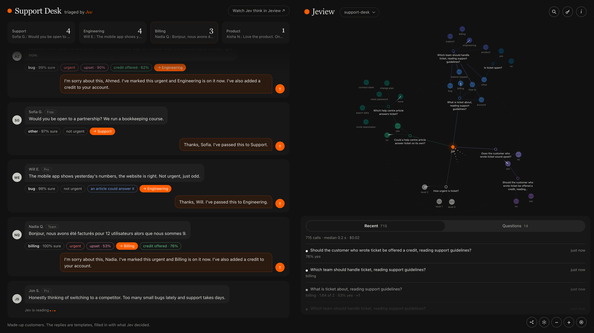

# Jeview

> Agents: [llms.txt](llms.txt) says how to use a running Jeview, and [AGENTS.md](AGENTS.md) how to work on this repository.

An unofficial local middleman for Jev ([TypeSafe](https://typesafe.ai) System One), with a live view of every call.
Jeview is an independent project: it is not made or endorsed by TypeSafe.

```
your code  →  Jeview (127.0.0.1:4777)  →  TypeSafe (api.typesafe.ai)
```

Jeview is a gateway: it sits between your code and TypeSafe and answers nothing itself. Point your Jev client at
Jeview instead of TypeSafe. Jeview sends each request on to Jev with your key, hands Jev's answer back, keeps every
call in a local SQLite database, and draws the calls on a live map as they happen.



## Run it

Needs Node 24 or later, and nothing else: Jeview has no dependencies to install.

```sh
./launch.sh
```

That finds a suitable Node (on your PATH, or installed by nvm or Homebrew), starts Jeview and opens the viewer at
http://127.0.0.1:4777/. `npm start` does the same without opening a browser. Add your TypeSafe API key (the key icon,
top right). The first time you open it, the viewer explains itself.

## See it working

Two demos send real Jev calls through Jeview. Run one in a second terminal and put its window beside Jeview's. Each
plays only while its page is open, costs about ten cents an hour while it does, and stops with Ctrl-C.

- `npm run demo`, then open http://127.0.0.1:4781/: Jev plays Pixel Knight, a tiny side-scroller, deciding every move.
- `npm run demo:support`, then open http://127.0.0.1:4782/: Jev triages a made-up support inbox, deciding what each
  message is about, how urgent it is, which team takes it and whether to offer a credit.

## Send requests to it

Send Jev requests to `http://127.0.0.1:4777/v1/systemone` instead of `https://api.typesafe.ai/v1/systemone`: the same
requests and the same answers, with no key needed from the caller.

- **Group requests** under a project or label by adding it to the path: `http://127.0.0.1:4777/my-project/v1/systemone`.
  The viewer can then show one group at a time.
- **Link calls.** Every answer comes back with an event id in `events`. When a later request follows from one of
  those answers, send its event id in a `Jeview-Trigger` header, and the map grows that request off the answer.
  Jeview drops its own headers before calling Jev and sends the body on unchanged.

Agents can read `http://127.0.0.1:4777/llms.txt`: a running Jeview serves it with its own address and whether a key is
set. [llms.txt](llms.txt) here is the same text, for the default address.

## Options

Given to either launcher: `./launch.sh --port 4800`, or `npm start -- --port 4800`.

- `--port 4777`
- `--dir ~/.local/share/jeview`: where the database lives
- `--jev-endpoint URL`: another Jev endpoint, such as a local mock

## Your data

Nothing is stored anywhere but your own machine. Jeview runs locally, has no accounts and no tracking, and the only
place it sends anything is TypeSafe, to make the calls you asked for.

Calls and your key are kept in `jeview.sqlite` in the data folder. The file is readable only by you, and the key is
stored in it as plain text. To erase everything, key included, stop Jeview and delete `jeview.sqlite*` from that folder.

A long history stays cheap: the viewer opens on the latest 20,000 calls, and search reaches the rest. Two Jeviews may
share a data folder, for instance on two ports, and each shows the calls of both.

Jeview listens on 127.0.0.1 only and has no login: anything running on your machine can read the recorded calls and
send calls with your key. It refuses requests from web pages on other sites, so a page you visit cannot. Do not put it
behind a public address.

## Develop

```sh
npm install # only the type checker
npm test
npm run typecheck
npm run check:pages # the viewer's and the demos' browser scripts parse
```

## License

MIT
